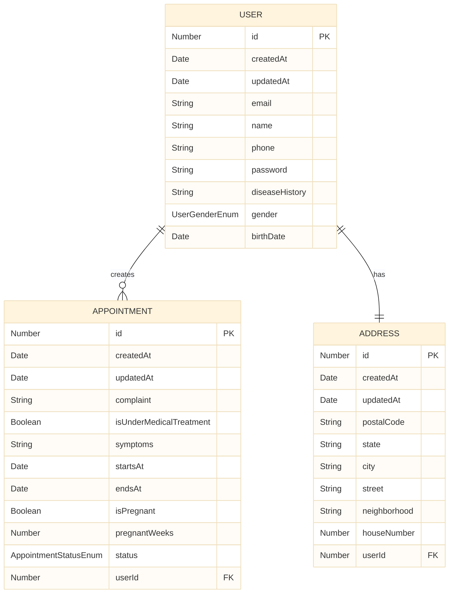
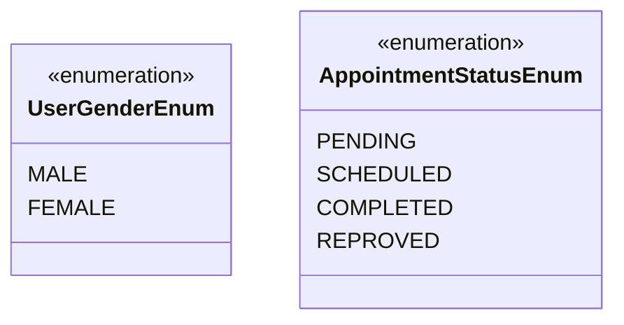

# Massage Therapy API

The backend for my massage therapy app, just to practice. 

Features:
- Authentication
- Create appointments
- Get user appointments

# Architecture

I'm using clean architecture to build this API, just to practice.

## Domain

**Entities**: The core business objects of our application.

**Usecases**: Application-specific business rules, independent of any external elements. They will describe how the entities are used to achieve some goal.

**Exceptions**: Business rules exceptions to show that something unexpected or invalid has occurred.

**Contracts**: Interfaces to interact with external elements (Dependency Inversion).

## Infrastructure

**Database**:
- Schemas: Database schemas (tables)
- Repositories: The implementation of the repositories
- Mappers: They transform Entities into Schema and Schema into Entities
- Services: External services

## Presenter

**Controllers**: HTTP controllers

**Models**: 
- Payloads: DTO representing the request body
- Queries: DTO representing query params
- View Models: DTO representing the response body

**Modules**: API modules that will handle our dependency injections

# Pipeline

For the pipeline, i'm using a Github [Action](./.github/workflows/pipeline.yml) to test and build, along with [Render's](https://render.com/) integration to deploy the API.

# Database

Currently using the free PostgreSQL instance at [Render](https://render.com/).

## Entities

