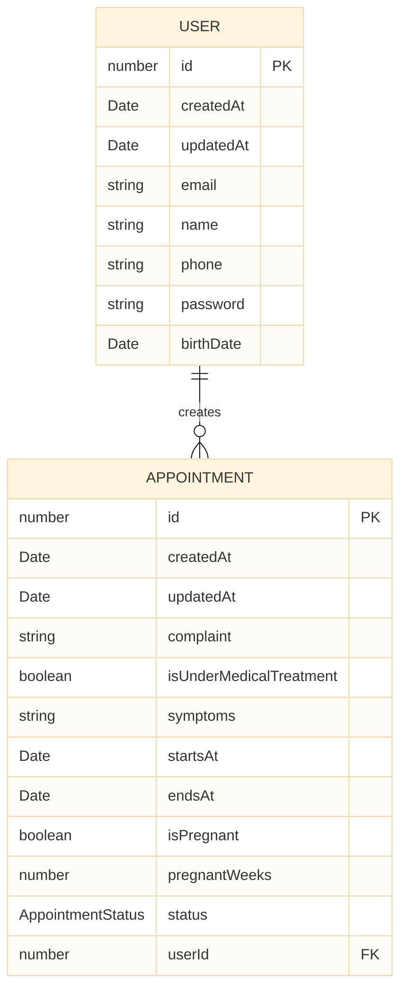
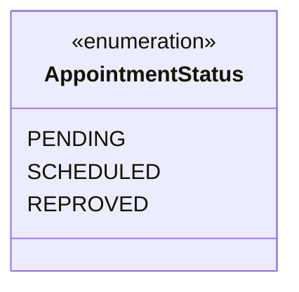

# Massage-therapy-api

## Entities

```mermaid
%%{init: {'theme':'base'}}%%
erDiagram
    USER ||--o{ APPOINTMENT : creates
    USER {
        number id PK
        Date createdAt
        Date updatedAt

        string email
        string name
        string phone
        string password
        Date birthDate
    }

    APPOINTMENT {
        number id PK
        Date createdAt
        Date updatedAt

        string complaint
        boolean isUnderMedicalTreatment
        string symptoms
        Date startsAt
        Date endsAt
        boolean isPregnant
        number pregnantWeeks
        AppointmentStatus status

        number userId FK
    }
```

```mermaid
classDiagram
class AppointmentStatus {
    <<enumeration>>
    PENDING
    SCHEDULED
    REPROVED
}
```