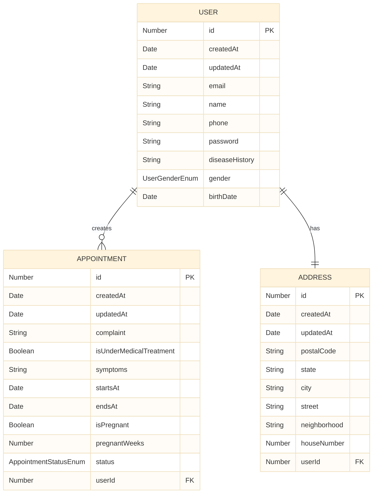
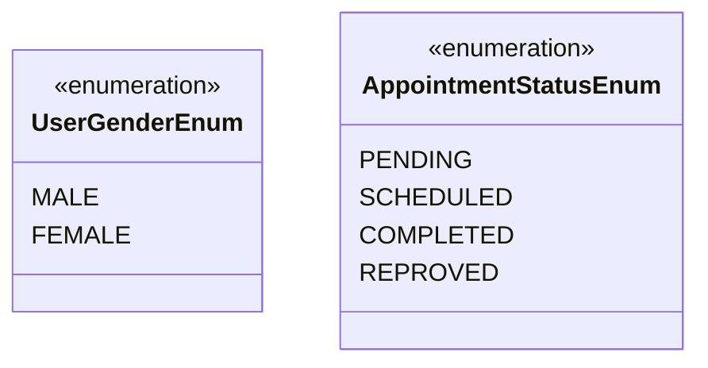

# Massage-therapy-api

## Entities

## Pipeline

For the pipeline, i'm using a Github [Action](./.github/workflows/pipeline.yml) to test and build, along with [Render's](https://render.com/) integration to deploy the API.

## Database

Currently using the free PostgreSQL instance at [Render](https://render.com/).
