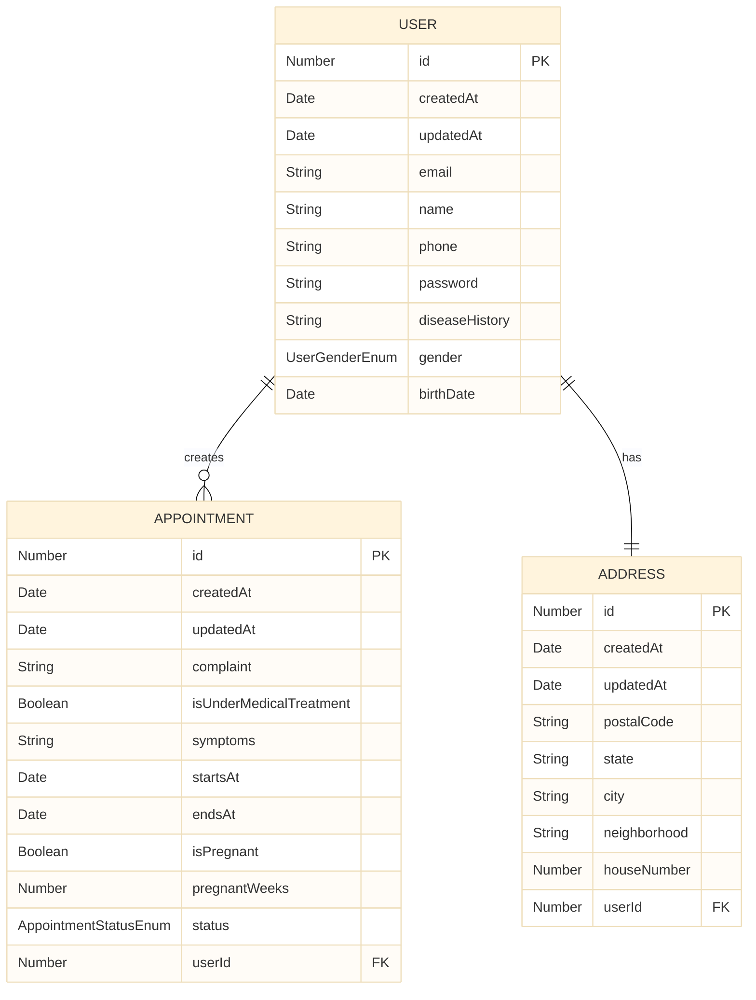
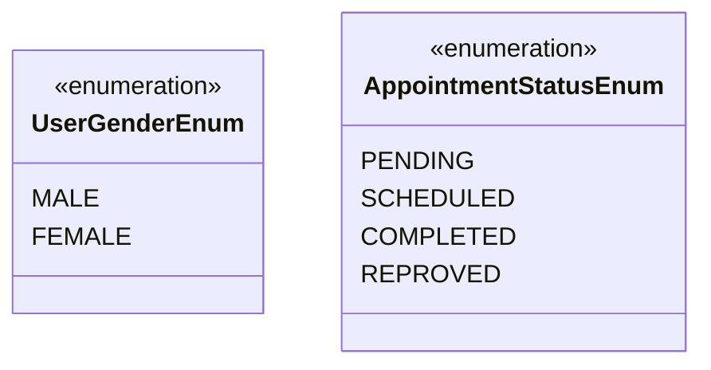

# Massage-therapy-api

## Entities

```mermaid
%%{init: {'theme':'base'}}%%
erDiagram
    USER ||--o{ APPOINTMENT : creates
    USER ||--|| ADDRESS : has
    USER {
        Number id PK
        Date createdAt
        Date updatedAt

        String email
        String name
        String phone
        String password
        String diseaseHistory
        UserGenderEnum gender
        Date birthDate
    }

    ADDRESS {
        Number id PK
        Date createdAt
        Date updatedAt

        String postalCode
        String state
        String city
        String neighborhood
        Number houseNumber
        Number userId FK
    }

    APPOINTMENT {
        Number id PK
        Date createdAt
        Date updatedAt

        String complaint
        Boolean isUnderMedicalTreatment
        String symptoms
        Date startsAt
        Date endsAt
        Boolean isPregnant
        Number pregnantWeeks
        AppointmentStatusEnum status

        Number userId FK
    }
```

```mermaid
classDiagram
    class UserGenderEnum {
        <<enumeration>>
        MALE
        FEMALE
    }

    class AppointmentStatusEnum {
        <<enumeration>>
        PENDING
        SCHEDULED
        COMPLETED
        REPROVED
    }
```