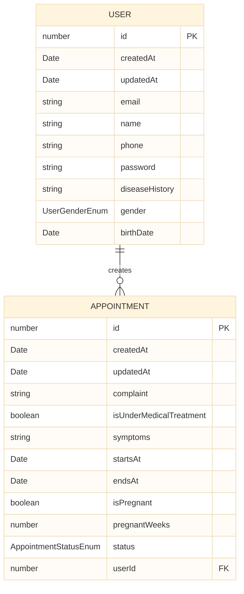
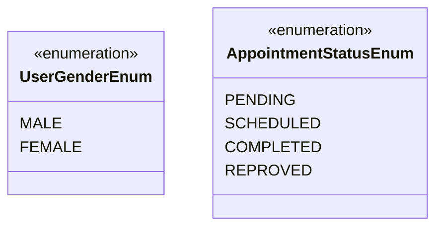

# Massage-therapy-api

## Entities

```mermaid
%%{init: {'theme':'base'}}%%
erDiagram
    USER ||--o{ APPOINTMENT : creates
    USER {
        number id PK
        Date createdAt
        Date updatedAt

        string email
        string name
        string phone
        string password
        string diseaseHistory
        UserGenderEnum gender
        Date birthDate
    }

    APPOINTMENT {
        number id PK
        Date createdAt
        Date updatedAt

        string complaint
        boolean isUnderMedicalTreatment
        string symptoms
        Date startsAt
        Date endsAt
        boolean isPregnant
        number pregnantWeeks
        AppointmentStatusEnum status

        number userId FK
    }
```

```mermaid
classDiagram
    class UserGenderEnum {
        <<enumeration>>
        MALE
        FEMALE
    }

    class AppointmentStatusEnum {
        <<enumeration>>
        PENDING
        SCHEDULED
        COMPLETED
        REPROVED
    }
```